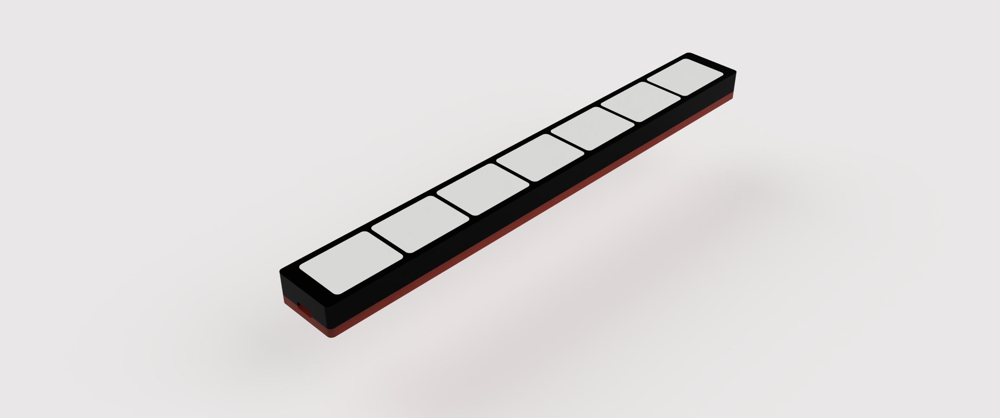

# 🌈 led-light-bar

> Smart led bar with 7 led's and brightness control.

## Parts

+ device - TINY85 Digispark USB module to control ws2812 LEDs
+ stl - 3d-models for printing

## Install

+ [FastLED](https://github.com/FastLED/FastLED)
+ [OneButton](https://github.com/mathertel/OneButton)

## Button control

`single click` - turn on led, select next mode

`double click` - turn off led

## How-To

Instructables [LED Light Bar](https://www.instructables.com/LED-Light-Bar/)

___

